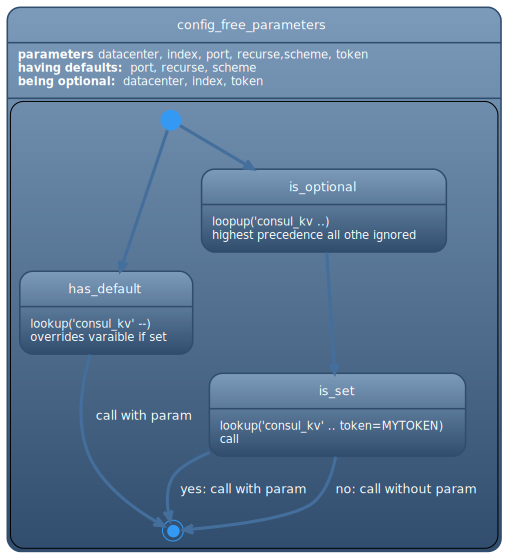

# testing-consul-kv

testing consul_kv.py isolation.
I currently see two problems:  
* with my first pr can I be sure the behaviour does now not break for the usecase where no token is provided ? #2
* there are other params in the same categroy https://github.com/ansible-collections/community.general/pull/2126#discussion_r602850247 do we treat then as well 
 * #3 
 * see also next section as an attempt to understand this category of parameters.


## trying to understand the desired configuration state in the plugin




## Notes on my little ci
* I have set a trigger that runs playbook.yml on my infrastructure against my consul.
* Logs are automatically published to [https://publog.ci.fkuep.de/consul-kv-github/RUN-NUMBER](https://publog.ci.fkuep.de/consul-kv-github/)
  * index.html has html of colored output
  * console-ascii-consul-kv-github-RUN-NUMBER.log is the console log in ascii with ansi-color removed
    * e.g `curl https://publog.ci.fkuep.de/consul-kv-github/9/console-ansi-consul-kv-github-9.log|  less `
  * console-ansi-consul-kv-github-RUN-NUMBER.log is the consule log with ansi colors. 
    * e.g: `curl https://publog.ci.fkuep.de/consul-kv-github/9/console-ansi-consul-kv-github-9.log|  less -r`


##### plantuml of that " desired configuration state" 
* I am keepinh that as a reference
``` plantuml

@startuml
!include https://raw.githubusercontent.com/bschwarz/puml-themes/master/themes/spacelab/puml-theme-spacelab.puml

hide empty description
state config_free_parameters  {
config_free_parameters: **parameters** datacenter, index, port, recurse,scheme, token
config_free_parameters: **having defaults:** port, recurse, scheme 
config_free_parameters: **being optional:** datacenter, index, token
 

is_set: ..
has_default: ..
is_optional:..

[*]--> has_default
[*] --> is_optional

is_optional --> is_set
is_set--> [*] : yes: call with param
is_set--> [*] : no: call without param

has_default-->[*] : call with param

}
@enduml

``` 